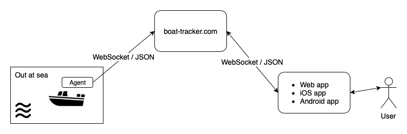

# Boat-Tracker

A solution for tracking boats.

The Boat-Tracker solution consist of the following components:

- a boat agent
- a backend server
- a web app
- native mobile applications (iOS and Android)

The server and frontend is deployed to [www.boat-tracker.com](https://www.boat-tracker.com/).

The [iOS app](https://itunes.apple.com/us/app/boat-tracker/id1434203398?ls=1&mt=8) codebase is in GitHub repository 
[boattracker-ios](https://github.com/malliina/boattracker-ios).

The Android app is in repo [boattracker-android](https://github.com/malliina/boattracker-android) but has not yet been
released to the store.

## Agent

The agent 

- listens to NMEA 0183 sentences in the boat; plotter connectivity is over WLAN or cable
- sends received sentences over a WebSocket to the backend at [www.boat-tracker.com](https://www.boat-tracker.com/)
- is typically installed on a Raspberry Pi with a 3G module, powered by the boat or external battery

## Backend

The backend 

- receives, processes and saves NMEA 0183 sentences from connected agents
- receives live automatic identification system (AIS) tracking data of vessels in the Gulf of Finland
- sends location updates to any connected web or mobile clients

## Frontend

The frontend 

- is the web app at [www.boat-tracker.com](https://www.boat-tracker.com/)
- updates live tracks as received from the backend
- shows saved tracks for signed in users
- provides a map view, table view and charts for visualization
